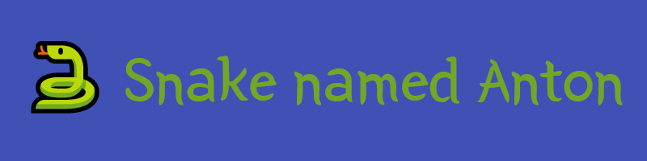

#### Video Demo:  https://youtu.be/jewlt1fmTdA
#### Description: My very first project. A classic snake game. 
Created for CS50’s Introduction to Programming with Python final project.

## Intro:
#### Launching: project.py
'project.py' is our main game file that contains all the code. Run it with python to launch the game.

#### Controls: Keyboard
WASD or Arrow keys to move snake.

ESC to quit.

#### Settings: Adjust these global variables in 'project.py'
`DESIRED_APPROXIMATE_RESOLUTION` Approximate pixel height and width of the window. 
Since `AREA` must be divisible by `CELL_NUMBER`, this takes the rough resolution and
does the math for you later to get the final resolution.

`CELL_NUMBER` Number of cells horizontally and one less vertically. Minimum is 3 because 
with 2 there would be only one cell left vertically and the `randrange()` function would not 
work. Minimum recommended is 12, any less than that and the scoreboard won't fit properly.

`START_SPEED` Starting speed in ms. Less is harder, more is easier.

`SPEED_INTERVALS` How much game speed increases(in ms) after each food consumed. 
Less is easier, more is harder.

`SPEED_LIMIT` Endgame speed in ms. Less is harder, more is easier

#### Objectives:
WIN: Snakes grows to half the field

LOSS: Snake collides with itself.

#### Mechanics:
Snake food is auto generated and will appear randomly

After passing the screen edge, snake will warp to the other side.

Auto reset after LOSS.

## Why snake game?:
Since this is my first project, I decided to go with something limited in scale. This was
one of the recommended project for beginners. I did play it back in the day on an old
phone, so there is a nostalgia factor.

## Why Anton?:
A tribute to my friend who encouraged me to get into programming.

## What I learned:
`pygame` module. This was completely new to me before this project. 

How to handle `pygame.Rect()`s. Create, track and move them. 

`pygame` events, and how keyboard controls work.

How to create and use .png with transparency. How to insert images and sound into pygame.

How `random.seed()` works.

Since lecture 9 does not have a problem set, I tried to use some of its material for this project:
- **Global Variables**: used extensively for settings throughout the whole game.
- **Constants**: All global variables are constant, and we use the fact that they can't change from a function to our advantage.
- **Sets and Set comprehension**: In 'test_project.py' we use set comprehension to find only unique values in a list
- **List Comprehension**: In 'test_project.py' we use it in combination with a `set` to check for unique values
- **Docstrings**: Written in every appropriate place.
- **Unpacking**: Used in `self.head.topleft = warp_on_borders(*self.head.topleft)` to reduce number of arguments.

## Challenges:
1.**Complying with final project requirements**: 
> Your main function must be in a file called project.py, 
> which should be in the “root” (i.e., top-level folder) of your project.
> Your 3 required custom functions other than main must also be in project.py and defined 
> at the same indentation level as main (i.e., not nested under any classes or functions).

This turned out to be the biggest challenge. Once you start writing code object-oriented,
it is hard to break out functions by themselves. Variable scope becomes an issue.

If not for this requirement, the code would look very differently. Probably  with no stand-alone functions at all.

2.**Moving the snake at variable speed**: Originally, movement was dependent on the FPS set
with `pygame.clock.tick()`. This did not allow the granularity I wanted, so it was remade 
to trigger by a timed event. This in itself introduced a bug that allowed you to go back in
on yourself if you pressed multiple buttons after frame change but before the event triggered.
This was solved with an extra safeguard `snake.last_move_direction`. After this I considered
removing the FPS ticks all together to make the game wait for movement event. This would improve
performance by a lot. But considering this is not a demanding game, and it's best practice to
keep refresh rate and game logic separate, refresh rate stays in. This can be useful
later on, if you expand this game with animations.

3.**Keeping different resolutions and sell number combinations compatible**: In my pursuit
of easily resizable game, there were many challenges. Everything had to be coded in relation
to cell size, images had to be resized dynamically after import. During testing, miscalculation
with where the Food can swap was quickly discover and fixed. Additional logic had to be added
so that the game resolution would always be divisible by cell number, otherwise edges had dead space.

4.**Keeping scoreboard separate from game area**: Debated between adding additional cell
on top of play area to keep it a perfect square. But decided to make the play area once cell
wider and keep the whole screen square in stead. This better corresponds with the players
expectation of how resolution works but requires you to track X and Y coordinates a bit 
differently throughout your code.

5.**Only initializing assets once for efficiency**: Took special care to create screen, 
surfaces, fonts, load pictures and sounds only once before the main game loop.
They should not be recreated even after game resets. 
This turned out to be a bit tricky because of variable scope. 

## Credits:
Thanks to the myriad of pygame tutorials on YouTube for helping me figure out this module.
[Especially this one](https://youtu.be/QFvqStqPCRU). Pygame docs were definitely not enough.

Free sound effects taken from here: [Free Game Sound Effects Download Pack](http://www.gameburp.com/free-game-sound-fx/)

Free sprite for hot dog taken from here: [Free Pixel foods](https://ghostpixxells.itch.io/pixelfood)